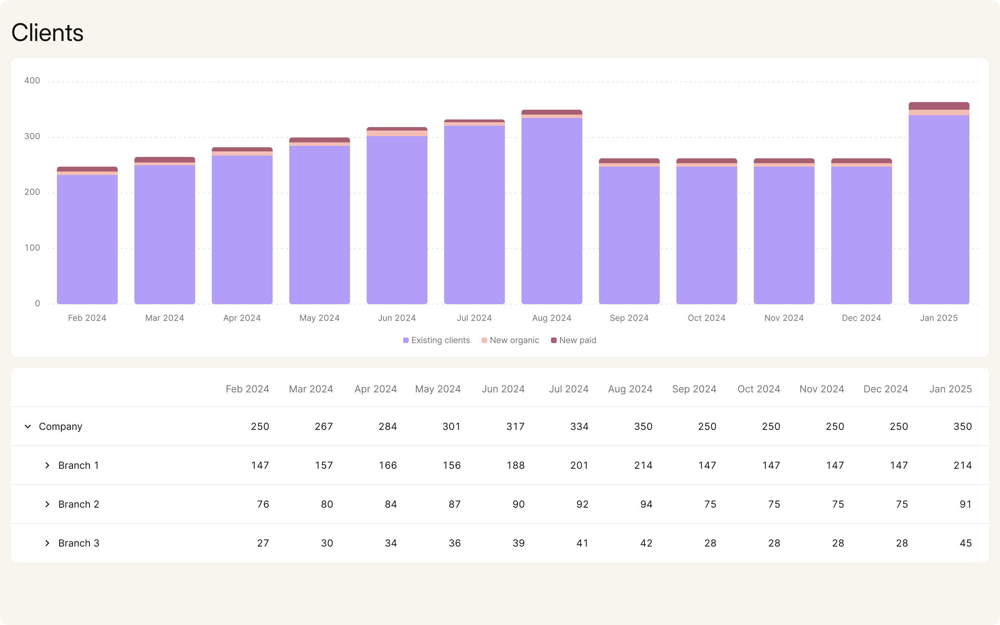

# Book of Business Dashboard

An accessible dashboard for exploring a client hierarchy over time. Selecting a row focuses the stacked bar chart on that node's direct children, or on the selected leaf itself.



[Original task](docs/original-task.md)

[Figma design](https://www.figma.com/design/t6itC2qsmr3WLPugwrVdqS/Web-engineer-home-task?node-id=1-2781) · [Interactive prototype](https://www.figma.com/proto/t6itC2qsmr3WLPugwrVdqS/Web-engineer-home-task?page-id=0%3A1&node-id=1-2781&viewport=-223%2C148%2C0.51&scaling=scale-down&content-scaling=fixed&starting-point-node-id=1%3A2781)

## Stack

React 19, TypeScript, Vite, Node.js with Express, Recharts, Tailwind CSS, lucide-react, Vitest, and pnpm.

## Run locally

Install dependencies, then run the API and client in separate terminals:

```bash
pnpm install
pnpm dev
pnpm dev:client
```

The API runs at `http://localhost:3001`; Vite runs at `http://localhost:5173` and proxies `/api` requests to the API.

## Commands

```bash
pnpm dev           # Start the normal API
pnpm dev:loading   # Delay the dashboard response for 3 seconds
pnpm dev:error     # Return the dashboard error response
pnpm dev:empty     # Return the dashboard payload without reporting periods
pnpm dev:client    # Start the Vite client
pnpm test          # Run unit and component tests
pnpm lint          # Run ESLint
pnpm typecheck     # Type-check server and client code
pnpm build         # Type-check and build the production client
pnpm format        # Format files with Prettier
pnpm format:check  # Check formatting without writing files
```

Run one API command at a time. To check the loading state, start `pnpm dev:loading` with `pnpm dev:client` and reload the page. To check error and retry, use `pnpm dev:error`; restarting the normal API before pressing Retry verifies recovery. Use `pnpm dev:empty` to check the empty-data state without changing the fixture.

## What is implemented

- `GET /api/business-overview`, backed by the immutable `server/data.json` fixture and its typed `tree`/`matrix` response.
- Loading, error, retry, and empty-data states for failed requests, non-success responses, malformed JSON, and successful responses without reporting periods.
- A stacked chart of direct children for parent nodes, or the selected leaf's trend.
- A treegrid with full-row pointer selection/expansion and keyboard navigation.
- Accessible treegrid semantics, a polite announcement after chart focus changes, and contained horizontal scrolling on narrow screens.

## Data contract and assumptions

The original supplied payload is immutable input for this assignment. The take-home API exposes a normalized `tree`/`matrix` representation so the UI can traverse one predictable hierarchy and associate every value with a reporting period.

In production, I would not unilaterally change the upstream data model or redefine business values in the frontend. I would align the contract with backend owners and analytics stakeholders: confirm metric meaning, reporting-calendar rules, hierarchy ownership, aggregation semantics, and the migration/versioning path.

- The API returns a Company → Branch → Employee → Channel tree and a dated matrix keyed by node id.
- Dates run from February 2024 through January 2025. Values are shown exactly as supplied; parent values are never recalculated from descendants.
- Employee avatars use local `/assets/avatars/<employee-id>.png` files and fall back to initials if an image fails to load.
- The fixture is trusted in this assignment. Runtime schema validation is intentionally not part of the delivered implementation.

## Problems in the original task and decisions

| Observed gap                                                                  | Take-home decision                                                | Production approach                                                                      |
| ----------------------------------------------------------------------------- | ----------------------------------------------------------------- | ---------------------------------------------------------------------------------------- |
| Values have no dates                                                          | The API returns dated matrix rows for February 2024–January 2025. | Agree reporting calendar, timezone, and ownership with analytics and backend.            |
| Hierarchy uses different nesting keys                                         | The API exposes one typed hierarchy.                              | Version a backend contract and keep upstream/raw data untouched.                         |
| Metric unit is unspecified                                                    | Show neutral integers.                                            | Confirm whether the metric is currency, count, or percentage, plus its formatting rules. |
| Parent totals differ from descendants                                         | Display values as supplied.                                       | Agree reconciliation and aggregation semantics with data owners.                         |
| The reference design includes avatars, but the payload has no avatar contract | Use local assets with initials fallback.                          | Define asset ownership, privacy constraints, and delivery path.                          |

## Proposed production improvements

- Validate hierarchy, identifiers, dates, and matrix membership at the API boundary; validate untrusted remote responses in the client as defence in depth.
- Establish API versioning and explicit ownership for the data schema.
- Add observability and contract-failure tests around the API boundary.
- Evaluate sticky table columns, a scroll-position indicator, and chart period-window navigation for production mobile use.

## Scalability & future improvements

If this dashboard needed to support a large enterprise hierarchy, I would consider the following.

### Table performance

- **Virtualization:** Use `@tanstack/react-virtual` to render only the tree rows in the viewport rather than every visible row.
- **Derived visible-row model:** Track expanded node IDs and derive one ordered visible-row collection for rendering, keyboard navigation, and windowing.
- **Server-driven lazy loading:** Fetch the root and top-level branches first, then fetch children as users expand a node.

### Chart rendering and legibility

- **Top N + Others:** Show the largest 5–10 contributors as series and group the rest into `Others`, with a drill-down path. Define the aggregation and ranking rules with analytics stakeholders.
- **Renderer evaluation:** Profile interaction and tooltip performance before replacing Recharts. Evaluate a Canvas-based chart renderer only if the current renderer is a measured bottleneck.

### Client-server boundary

- **Data pruning and pagination:** Move search, filtering, aggregation, and pagination to the API so the client receives only the hierarchy slice and reporting periods it can render.

## Tests and manual smoke checks

Vitest covers pure data helpers, treegrid interaction and keyboard navigation, and chart rendering. Loading/error/retry and the selection-driven chart/live announcement are intentionally checked manually with the reviewer scenarios above.

## Scope

Filtering, sorting, pagination, export, persistence, authentication, and live updates are intentionally out of scope.
